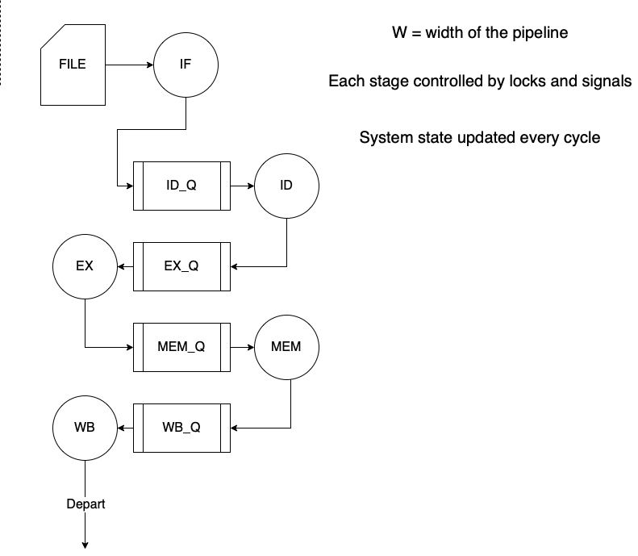

CMPT 305 Project 2

Group member  
- Bo (Jerry) Wang
- Qian (Levi) Wang
- Wenhui (Warren) Wu

Development abstract:

In 12 days, our group needs to implement a simple 5-stage in-order pipeline simulator.

Some assumption are made to simplify the project:
1. No branch prediction
2. No cash misses
3. All stage execute in 1 cycle
4. Only five types of instructions:
	- Integer instruction
	- Floating point instruction
	- Branch
	- Load
	- Store

With the knowledge and skills learned from the class, we accomplished the task by using discrete time simulation method. With the power of class in C++, we choose the object-oriented approach to solve the problem. Using the idea of "Lock", we can emulate how the system deal with Structural hazards, Control hazards, and Data hazards.

This is the flowchart we came up for this project:

---

## Executable
The executable should run using the following command line parameter format:

`./proj2 trace_file_name start_inst inst_count W`

Where trace_file_name is the complete path to the trace file; start_inst is the instruction in the trace to start the simulation; inst_count is the number of instructions to simulate starting from start_inst; and W is the pipeline width.    

For example:

`./proj2  srv_0 10000000 1000000 2 `

Should simulate a 2-wide processor using the srv_0 trace starting from instruction 10M and simulating 1M instructions.

## Experimental Design Report
The report is a pdf file that contains the results of the two factor analysis. The report include the results of all replications for each of the 4 levels of W and 3 traces, the overall mean, the impact of each level, and the allocation of variation results.
